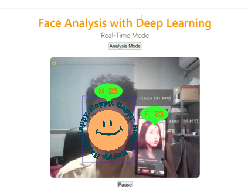

# Portfolio of Personal Project

## Real-Time Face Analysis for Customer Segmentation

Build Flask web application that utilizes a convolutional deep neural network model to detect faces in real-time webcam feeds from scratch. Upon detection, the application predicts the age, gender, and ethnicity of the individuals, displaying the results alongside the live video stream. The application continuously captures frames, analyzes them, and provides immediate feedback on the identified attributes of the detected faces. The results are automatically sent and analyzed to provide demographical analysis in Excel.

Users can interact with the application by adjusting verification criteria for gender, race, and age, receiving immediate feedback on the accuracy of predictions.

- [Github Repo](https://github.com/azraimahadan/Face-Analysis-for-Customer-Segmentation)
- [Brochure](https://github.com/azraimahadan/Face-Analysis-for-Customer-Segmentation/blob/main/poster.PNG)

Technologies used:  
- Model Development - Python, Tensorflow, OpenCV, Pandas
- Model Deployment & Monitoring - Flask, Excel

## Skills Extracting with BERT

Build an application leveraging BERT language model for skill extraction from job descriptions. This tool employs advanced natural language processing techniques and fine-tuned LLM to automatically identify and extract essential skills, enhancing the efficiency of talent acquisition processes

- [Github Repo](https://github.com/azraimahadan/skill-extraction-with-bert)
- [Streamlit App](https://skill-extraction-with-bert-yvf7zfcahggh5zyi6zfgwn.streamlit.app/)
- [HuggingFace space](https://huggingface.co/spaces/azrai99/Skills-Extraction-from-Job-Post)

Technologies used: Python, Pytorch, Streamlit, HuggingFace

## Prophet Forecasting App

Build an application for time series forecasting using Facebook Prophet. This application allows users to upload CSV files containing time series data, preprocesses the data, and generates forecasts for future time periods. It utilizes the Prophet library to fit models and visualize forecast components, enabling users to gain insights into the underlying trends and patterns in their data

- [Github Repo](https://github.com/azraimahadan/prophet-forecast)

Technologies used: Python, Fbprophet, Pandas Streamlit

## Essay Score Prediction with Writing Style

Build 2 types of ML model, Light Gradient Boost Machine(LGBM) and Linear Regression to explore the relationship between learners’ writing behaviors and writing performance, which could provide valuable insights for intelligent tutoring systems. The project leverage Optuna as a faster way to optimizing hyperarameter of LGBM to provide better model performance.

- [Github](https://github.com/azraimahadan/portfolio/tree/main/Linking%20writing%20with%20Essay%20Score)

Technologies used: Python, LGBM, Linear Regression, sklearn, Optuna, matplotlib